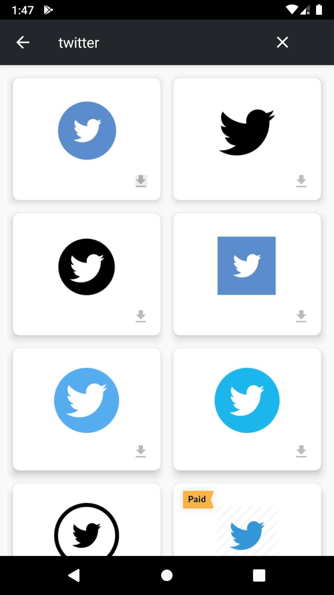

# IconFinderDemo

&nbsp;&nbsp;&nbsp;

## Concepts
- Retrofit (for fetching data from API and downloading icons)
- Architecture Components (For handling lifecycle changes and observing data)
- MVVM Architecture with Repository Pattern

## Get Started

- Clone the repo and open the project
- Put the CLIENT_ID and CLIENT_SECRET in `gradle.properties` (Global) file
- Run the project
